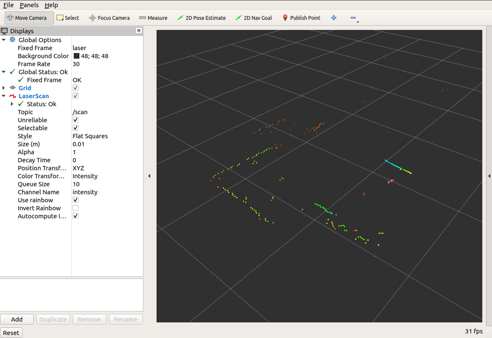

## A Collection of ROS2 Sensor Drivers for Projects

### ROS2 version: Dashing  (Ubuntu 18.04)

#### HLS LFCD LDS 2D Laser

[HLS LFCD LDS 2D LASER DRIVER](https://github.com/ROBOTIS-GIT/hls_lfcd_lds_driver/tree/dashing-devel)  

$ colcon build --symlink-install  

$ ros2 launch hls_lfcd_lds_driver hlds_laser.launch.py  

$ ros2 run tf2_ros static_transform_publisher 0 0 0 0 0 0 map laser  

$ ros2 launch hls_lfcd_lds_driver view_hlds_laser.launch.py  

<!--
 
-->
 

