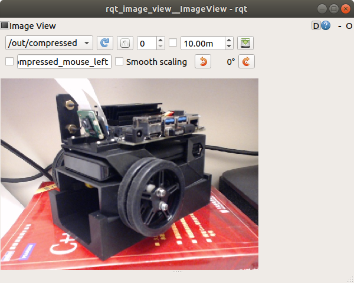

## A Collection of ROS2 Sensor Drivers for Projects

### ROS2 version: Dashing  (Ubuntu 18.04)

#### HLS LFCD LDS 2D Laser

[HLS LFCD LDS 2D LASER DRIVER](https://github.com/ROBOTIS-GIT/hls_lfcd_lds_driver/tree/dashing-devel)  

$ colcon build --symlink-install  

$ ros2 launch hls_lfcd_lds_driver hlds_laser.launch.py  

$ ros2 run tf2_ros static_transform_publisher 0 0 0 0 0 0 map laser  

$ ros2 launch hls_lfcd_lds_driver view_hlds_laser.launch.py  

<!--
 
-->
  
  

#### USB Camera (2D)

[REFERENCE](https://github.com/klintan/ros2_usb_camera)  

$ colcon build --symlink-install  

$ ros2 run usb_camera_driver usb_camera_driver_node  

$ ros2 run image_transport republish raw in:=image_raw compressed out:=image_raw_compressed  

$ ros2 run rqt_image_view rqt_image_view  

  
  
  

#### ZED Stereo Camera

[ZED Stereo Camera SDK Jetpack 4.2](https://www.stereolabs.com/developers/release/#sdkdownloads_anchor)  

$ sudo /usr/local/zed/tools/'ZED Diagnostic'  

  

$ sudo /usr/local/zed/tools/'ZED Explorer'  
